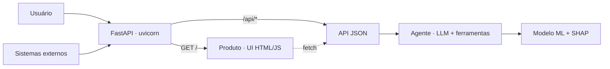

# ChurnPredictor

**Agente de previsão de churn para telecom** — Trilha 1.1.

ChurnPredictor recebe o perfil de um cliente de telecom, raciocina sobre o **risco de cancelamento
(churn)** e devolve **probabilidade + explicação + ação de retenção**. É um ciclo completo
*agente → API → produto*:

- O **modelo de ML** (Gradient Boosting + SHAP) entrega a probabilidade e os fatores de risco.
- Um **agente com LLM** (OpenAI) traduz isso em linguagem natural e recomenda a ação de retenção.
- **Guardrails** (entrada/saída) e um **fallback determinístico** garantem confiabilidade quando o
  LLM falha, está fora do ar ou responde de forma incoerente.

## Links

| | |
|---|---|
| **Aplicação (no ar)** | <https://churn.lcsgborges.cloud/> |
| **Documentação (MkDocs)** | <https://lcsgborges.github.io/churn-predictor/> |
| **Repositório** | <https://github.com/lcsgborges/churn-predictor> |
| **Relatório completo** | [REPORT.md](REPORT.md) |
| **Deploy na VPS (EasyPanel)** | [docs/deploy.md](docs/deploy.md) |
| **Data card** | [data/DATA_CARD.md](data/DATA_CARD.md) |

## Arquitetura (resumo)



Um único processo (FastAPI/uvicorn) serve **produto e API** no mesmo link.

## Rodar localmente (um comando)

```bash
cp .env.example .env      # opcional: preencha OPENAI_API_KEY (sem ela, roda em modo fallback)
docker compose up --build
```

- Produto: <http://localhost:7860/>
- API (docs): <http://localhost:7860/api/docs>
- Health: <http://localhost:7860/api/health>

Exemplo de chamada à API:

```bash
curl -X POST http://localhost:7860/api/predict -H 'Content-Type: application/json' -d '{
  "gender":"Female","SeniorCitizen":0,"Partner":"No","Dependents":"No","tenure":2,
  "PhoneService":"Yes","MultipleLines":"No","InternetService":"Fiber optic",
  "OnlineSecurity":"No","OnlineBackup":"No","DeviceProtection":"No","TechSupport":"No",
  "StreamingTV":"Yes","StreamingMovies":"Yes","Contract":"Month-to-month",
  "PaperlessBilling":"Yes","PaymentMethod":"Electronic check",
  "MonthlyCharges":95.0,"TotalCharges":190.0}'
```

## Desenvolvimento (sem Docker)

```bash
python -m venv .venv && source .venv/bin/activate
pip install -r requirements.txt
python -m ml.train                                   # treina models/churn_model.pkl
uvicorn api.main:app --reload --port 7860            # UI (/) + API (/api/*) no mesmo processo
pytest                                               # testes
```

## Estrutura

| Pasta | Papel |
|---|---|
| `ml/` | pré-processamento, treino, predição e explicação (SHAP) |
| `agent/` | orquestração do agente, prompts, ferramentas, guardrails, fallback |
| `api/` | FastAPI: API JSON (`/api/*`) **e** a UI (`GET /`, templates Jinja2) |
| `product/` | template da UI (`templates/index.html`) + metadados do formulário |
| `monitoring/` | tracing JSONL (latência, custo, fallback, guardrails) |
| `data/` | dataset Telco Churn + Data Card |

## Deploy

Em produção o sistema roda numa VPS via **EasyPanel**: um único container, build a partir do
`Dockerfile` (Build Path `/`) e `OPENAI_API_KEY` nas variáveis de ambiente.
Passo a passo completo em [docs/deploy.md](docs/deploy.md).

App no ar: <https://churn.lcsgborges.cloud/>.
