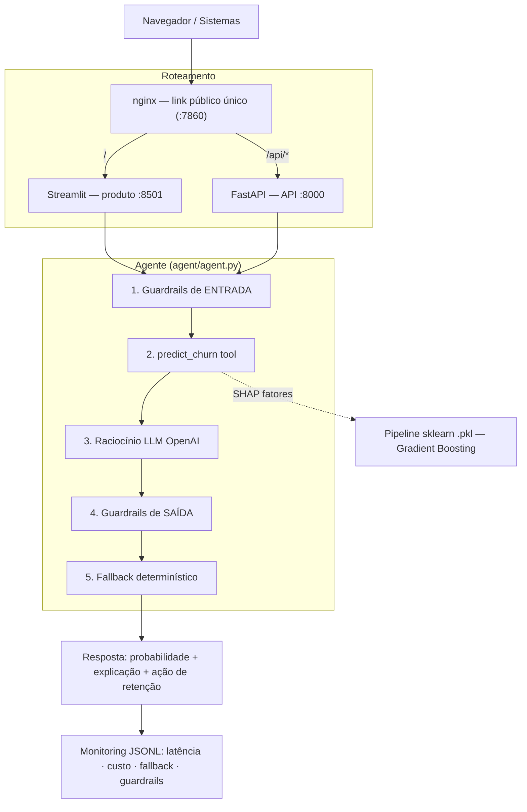
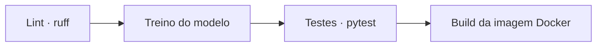
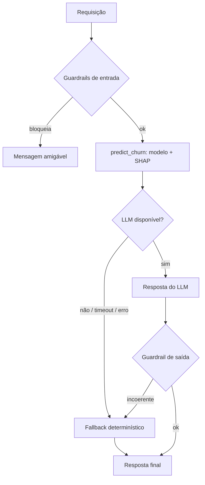

# Arquitetura

## Visão geral

## Um container, um link

O Hugging Face Spaces expõe **uma** porta. Um **nginx** escuta na porta pública (7860) e roteia:

- `/` → **Streamlit** (produto)
- `/api/*` → **FastAPI** (API pública: `/api/predict`, `/api/health`, `/api/docs`)

Assim **produto e API ficam no mesmo endereço**. O `start.sh` sobe os três processos:
`uvicorn` (:8000) + `streamlit` (:8501) + `nginx` (:7860, foreground).

## Componentes

| Camada | Pasta | Responsabilidade |
|---|---|---|
| Modelo | `ml/` | pré-processamento, treino, predição e explicação (SHAP) |
| Agente | `agent/` | orquestração, prompts, ferramentas, guardrails, fallback |
| API | `api/` | FastAPI + schemas Pydantic |
| Produto | `product/` | painel Streamlit (Análise, Chat, Monitoramento) |
| Monitoramento | `monitoring/` | traces JSONL e agregação de métricas |

## Exploração de abordagens (agent/model)

O que consideramos antes de decidir:

- **Tipo de agente:** (a) um classificador "puro" exposto via API vs. (b) um **agente com raciocínio**.
  Escolhemos (b), com *function calling*: o modelo ML entrega o número e os fatores; o LLM traduz em
  explicação e ação. É a diferença "modelo → agente" pedida no enunciado.
- **Ferramentas:** **uma ferramenta única e forte** (`predict_churn` = modelo + SHAP) em vez de várias
  fracas (uma para probabilidade, outra para explicação, outra para ofertas) — menos latência e menos
  superfície de erro. A ideia das múltiplas tools foi **descartada**.
- **Modelo base do agente:** `gpt-4o-mini` — barato, baixa latência e suficiente para raciocínio
  estruturado sobre poucos fatores. Modelos maiores não se justificavam pelo custo/latência neste escopo.
- **Modelo preditivo:** comparamos **Regressão Logística** (baseline) e **Gradient Boosting** (escolhido) —
  ver [Avaliação](avaliacao.md).

## Decisões de projeto

- **Uma ferramenta forte** (`predict_churn`) em vez de várias fracas → menos latência e menos erro.
- **Separação de responsabilidades:** o número vem do modelo (determinístico, auditável); o LLM só
  comunica. Isso torna o *fallback* trivial e a explicação à prova de alucinação.
- **Treino no build:** o `Dockerfile` roda `python -m ml.train`, então clone → build → sobe, sem passo manual.

## Deployment

- **Empacotamento:** um único `Dockerfile` instala tudo, **treina o modelo no build** e roda três
  processos via `start.sh` (uvicorn + Streamlit + nginx). Reprodutível: clone → `docker compose up` → no ar.
- **Exposição:** uma porta pública (7860); o nginx roteia `/` → produto e `/api/*` → API.
- **Entradas em produção:** a API recebe perfis de clientes (mesmo esquema do dataset) via
  `POST /api/predict` ou `POST /api/chat`; o produto monta esse JSON a partir do formulário.
- Passo a passo em [Como rodar](como-rodar.md) e [Deploy na VPS](deploy.md).

## CI/CD

**GitHub Actions** ([`.github/workflows/ci.yml`](https://github.com/lcsgborges/churn-predictor/blob/main/.github/workflows/ci.yml)),
a cada push/PR:

Qualquer etapa que falhar quebra o merge. A documentação tem um workflow próprio
([`docs.yml`](https://github.com/lcsgborges/churn-predictor/blob/main/.github/workflows/docs.yml)) que
publica este site no **GitHub Pages** a cada push na `main`.

## Confiabilidade (fallback)

