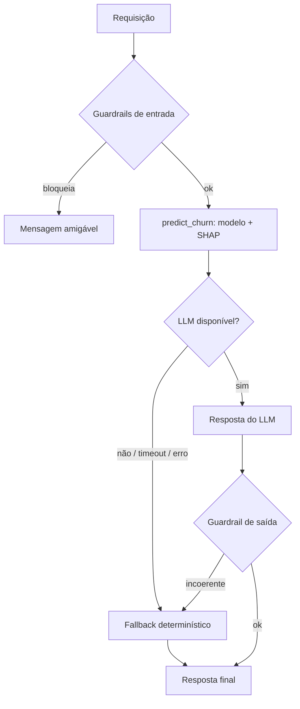

# Arquitetura

## Visão geral

```
                        Link público único — nginx (porta 7860)
                 ┌───────────────────────────────────────────────┐
   Navegador ───▶│  /        → Streamlit  (produto :8501)         │
   Sistemas  ───▶│  /api/*   → FastAPI    (API :8000)             │
                 └───────────────────┬───────────────────────────┘
                                     ▼
                       ┌─────────────────────────────┐
                       │  Agente (agent/agent.py)     │
                       │  1. Guardrails de ENTRADA    │  perfil + mensagem
                       │  2. predict_churn (tool) ────┼──▶ Pipeline sklearn (.pkl)
                       │        └─ SHAP (fatores)     │      Gradient Boosting
                       │  3. Raciocínio LLM (OpenAI)  │
                       │  4. Guardrails de SAÍDA      │
                       │  5. FALLBACK determinístico  │
                       └───────────────┬─────────────┘
                                       ▼
                Resposta: probabilidade + explicação + ação de retenção
                                       ▼
                Monitoring (JSONL): latência · custo · fallback · guardrails
```

## Um container, um link

O Hugging Face Spaces expõe **uma** porta. Um **nginx** escuta na porta pública (7860) e roteia:

- `/` → **Streamlit** (produto)
- `/api/*` → **FastAPI** (API pública: `/api/predict`, `/api/health`, `/api/docs`)

Assim **produto e API ficam no mesmo endereço**. O `start.sh` sobe os três processos:
`uvicorn` (:8000) + `streamlit` (:8501) + `nginx` (:7860, foreground).

## Componentes

| Camada | Pasta | Responsabilidade |
|---|---|---|
| Modelo | `ml/` | pré-processamento, treino, predição e explicação (SHAP) |
| Agente | `agent/` | orquestração, prompts, ferramentas, guardrails, fallback |
| API | `api/` | FastAPI + schemas Pydantic |
| Produto | `product/` | painel Streamlit (Análise, Chat, Monitoramento) |
| Monitoramento | `monitoring/` | traces JSONL e agregação de métricas |

## Decisões de projeto

- **Uma ferramenta forte** (`predict_churn`) em vez de várias fracas → menos latência e menos erro.
- **Separação de responsabilidades:** o número vem do modelo (determinístico, auditável); o LLM só
  comunica. Isso torna o *fallback* trivial e a explicação à prova de alucinação.
- **Treino no build:** o `Dockerfile` roda `python -m ml.train`, então clone → build → sobe, sem passo manual.

## Confiabilidade (fallback)


