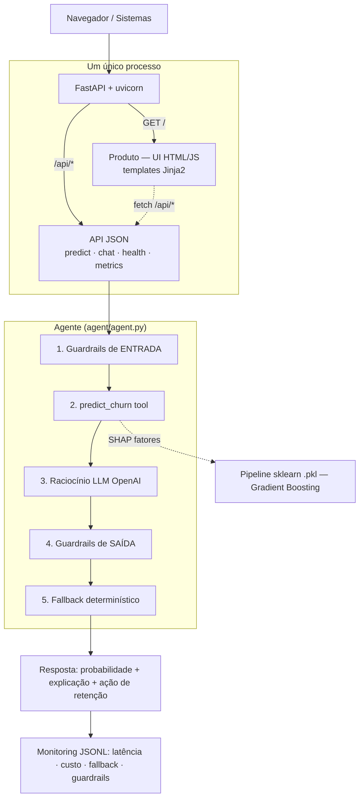
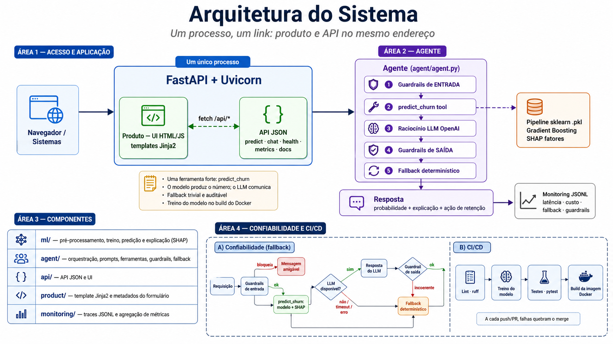
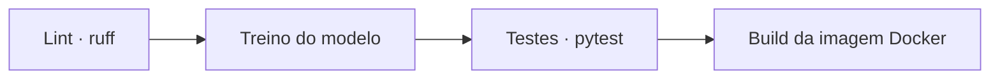
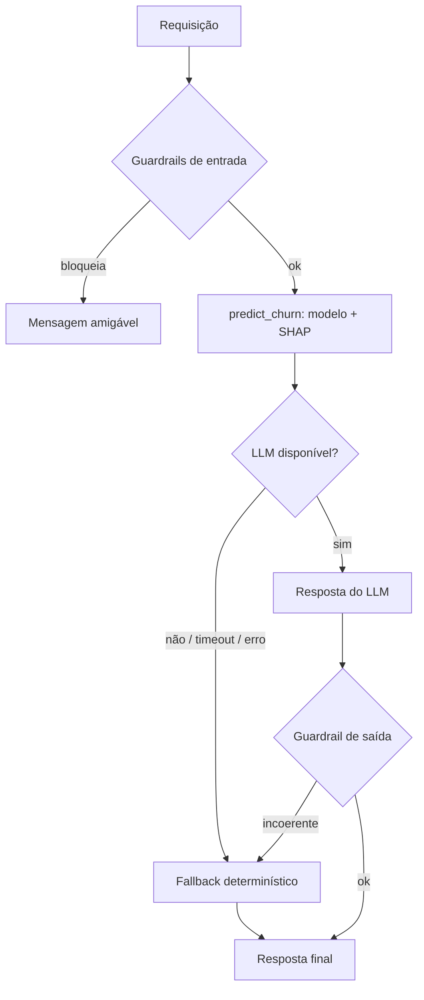

# Arquitetura

## Visão geral

## Um processo, um link

Um **único processo** (`uvicorn`) serve toda a aplicação:

- `/` → **produto** (UI em HTML, templates Jinja2 + JavaScript que consome a API)
- `/api/*` → **API JSON** (`/api/predict`, `/api/chat`, `/api/health`, `/api/metrics`, `/api/docs`)

Assim **produto e API ficam no mesmo endereço**. A UI é servida pelo próprio FastAPI e chama os
endpoints `/api/*` via `fetch`; os gráficos (medidor de churn e fatores SHAP) são **SVG inline**.
Menos peças, um único processo, deploy mais simples e confiável.

## Componentes

| Camada | Pasta | Responsabilidade |
|---|---|---|
| Modelo | `ml/` | pré-processamento, treino, predição e explicação (SHAP) |
| Agente | `agent/` | orquestração, prompts, ferramentas, guardrails, fallback |
| API + Produto | `api/` | FastAPI: API JSON (`/api/*`) **e** a UI (`GET /`) |
| UI (templates) | `product/` | template Jinja2 (`templates/index.html`) + metadados do formulário |
| Monitoramento | `monitoring/` | traces JSONL e agregação de métricas |

## Exploração de abordagens (agent/model)

O que consideramos antes de decidir:

- **Tipo de agente:** (a) um classificador "puro" exposto via API vs. (b) um **agente com raciocínio**.
  Escolhemos (b), com *function calling*: o modelo ML entrega o número e os fatores; o LLM traduz em
  explicação e ação. É a diferença "modelo → agente" pedida no enunciado.
- **Ferramentas:** **uma ferramenta única e forte** (`predict_churn` = modelo + SHAP) em vez de várias
  fracas (uma para probabilidade, outra para explicação, outra para ofertas) — menos latência e menos
  superfície de erro. A ideia das múltiplas tools foi **descartada**.
- **Modelo base do agente:** `gpt-4o-mini` — barato, baixa latência e suficiente para raciocínio
  estruturado sobre poucos fatores. Modelos maiores não se justificavam pelo custo/latência neste escopo.
- **Modelo preditivo:** comparamos **Regressão Logística** (baseline) e **Gradient Boosting** (escolhido) —
  ver [Avaliação](avaliacao.md).

A visão abaixo reúne essas escolhas e mostra como o modelo preditivo, a ferramenta, o LLM e os
mecanismos de confiabilidade se conectam no sistema:

{ loading=lazy }

_Resumo visual da arquitetura e das principais decisões do projeto._

## Decisões de projeto

- **Uma ferramenta forte** (`predict_churn`) em vez de várias fracas → menos latência e menos erro.
- **Separação de responsabilidades:** o número vem do modelo (determinístico, auditável); o LLM só
  comunica. Isso torna o *fallback* trivial e a explicação à prova de alucinação.
- **Treino no build:** o `Dockerfile` roda `python -m ml.train`, então clone → build → sobe, sem passo manual.

## Deployment

- **Empacotamento:** um único `Dockerfile` (multi-stage) instala tudo, **treina o modelo no build** e
  roda **um único processo** — `uvicorn api.main:app`. Reprodutível: clone →
  `docker compose up` → no ar.
- **Exposição:** o próprio FastAPI serve `/` (UI) e `/api/*` (API) no mesmo endereço público.
- **Entradas em produção:** a API recebe perfis de clientes (mesmo esquema do dataset) via
  `POST /api/predict` ou `POST /api/chat`; a UI monta esse JSON a partir do formulário e chama via `fetch`.
- Passo a passo em [Como rodar](como-rodar.md) e [Deploy na VPS](deploy.md).

## CI/CD

**GitHub Actions** ([`.github/workflows/ci.yml`](https://github.com/lcsgborges/churn-predictor/blob/main/.github/workflows/ci.yml)),
a cada push/PR:

Qualquer etapa que falhar quebra o merge. A documentação tem um workflow próprio
([`docs.yml`](https://github.com/lcsgborges/churn-predictor/blob/main/.github/workflows/docs.yml)) que
publica este site no **GitHub Pages** a cada push na `main`.

## Confiabilidade (fallback)

